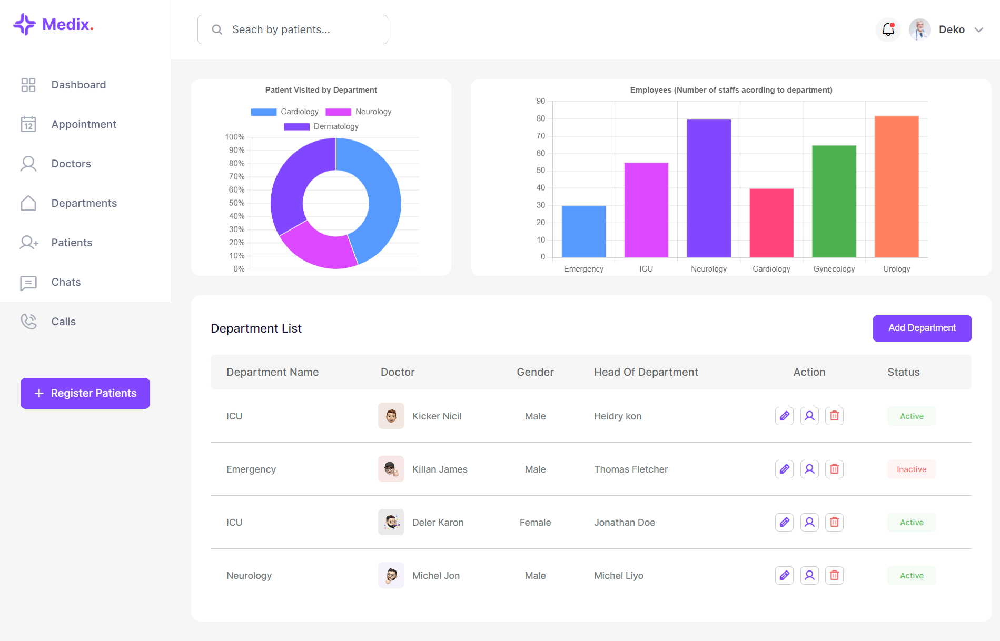

# Department List Dashboard

A very simple department list dashboard

## Table of contents

- [Overview](#overview)
  - [The challenge](#the-challenge)
  - [Screenshot](#screenshot)
  - [Links](#links)
- [My process](#my-process)
  - [Built with](#built-with)
- [Author](#author)
- [Acknowledgments](#acknowledgments)

## Overview

### The challenge

Users should be able to:

- See a simple dashboard

### Screenshot

### Links

- Live Site URL: [https://quiel-department-list-ui.netlify.app/](https://quiel-department-list-ui.netlify.app/)

## My process

### Built with

- HTML5
- Sass

## Author

- GitHub - [quielLovesLasagna](https://github.com/quielLovesLasagna)

## Acknowledgments

I would like to thank [Pomaline Moses Olanrewaju](https://www.figma.com/@primeleonard) for the design.
